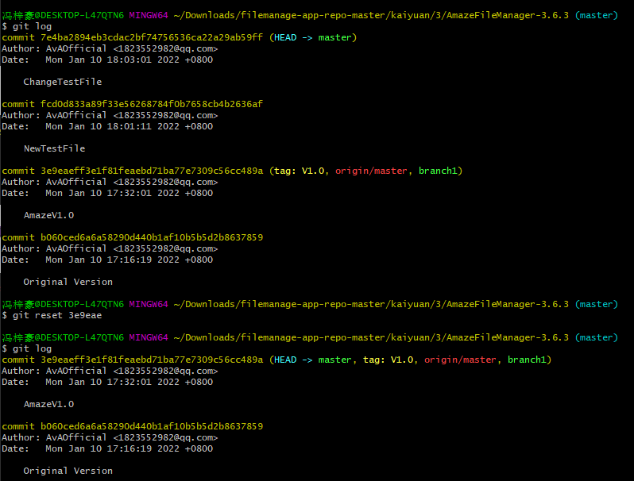
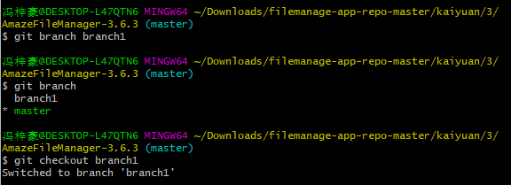
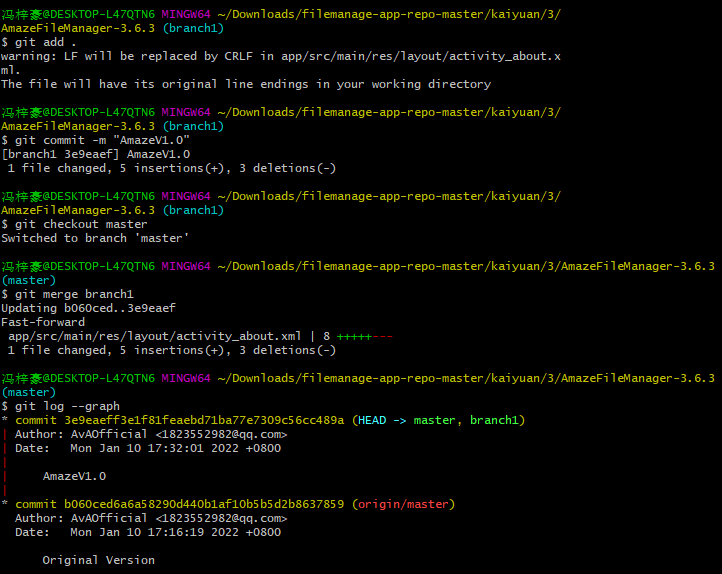

## 软件工程实验六：项目协同开发管理与工具集成环境实验

#### 191220028 冯梓豪

### 实验内容一：在本地尝试修改、提交、回退等过程

在项目目录下添加test.txt文件，输入`git status`查看状态：

	

对test.txt内容进行修改，修改后输入`git diff`查看差异：

	

使用`git log`查看日志，尝试回退，回退的目标是V1.0版本，在日志中获取到V1.0的序列号，所以使用`git reset 3e9eae`指令回退，成功后再次使用`git log`，确认顺利回退：

	

### 实验内容二：使用分支进行项目开发

由于实验三对app的修改只发生在一个文件里，所以仅开辟了一个新分支；

在Git Bash中新建分支branch1，查看并切换到新建分支

		

在分支1开发完毕后，切换回主分支，并将分支合并，使用`git log --graph`指令展示分支合并图

	

对修改后的最终版本打上tag

	

### 问题

#### 1.使用git的好处？

1）可以离线工作，在本地完成提交代码、查看历史、分支等所有操作

2）适合分布式开发，灵活

3）拥有全世界最大的开源社区github，可以方便地接触到各种优秀代码

#### 2.使用远程仓库的好处？

1）有助于多人协同开发

2）利于代码的保存，适合对项目做备份

#### 3.在开发中使用分支的好处？

1）提高开发的效率，各个分支可以同步进行

2）避免了在单一master分支上进行开发遇到的冲突问题
