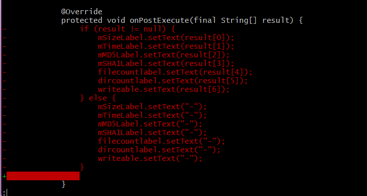
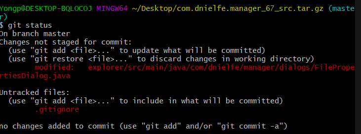
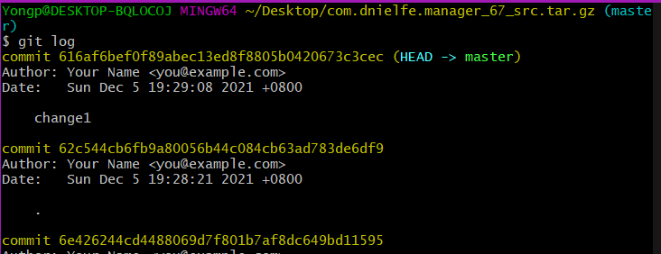
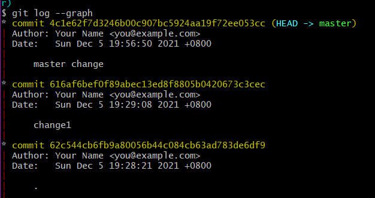
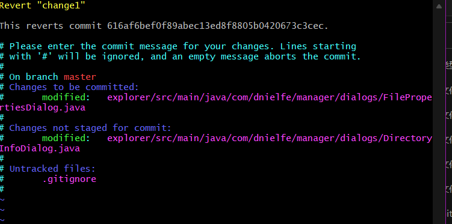
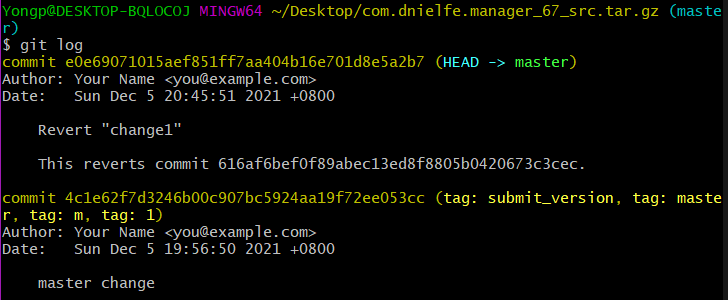
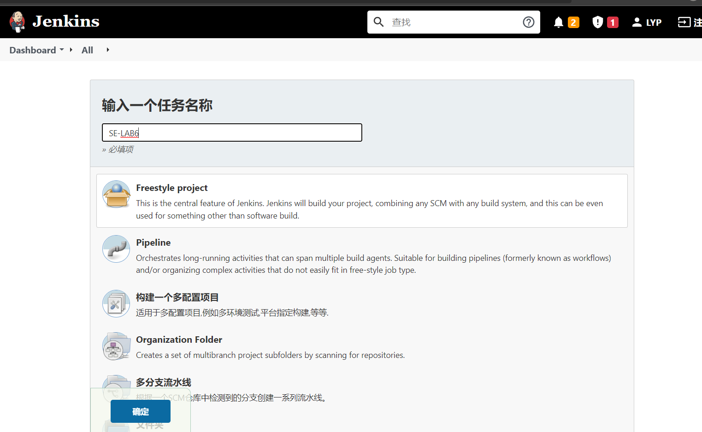
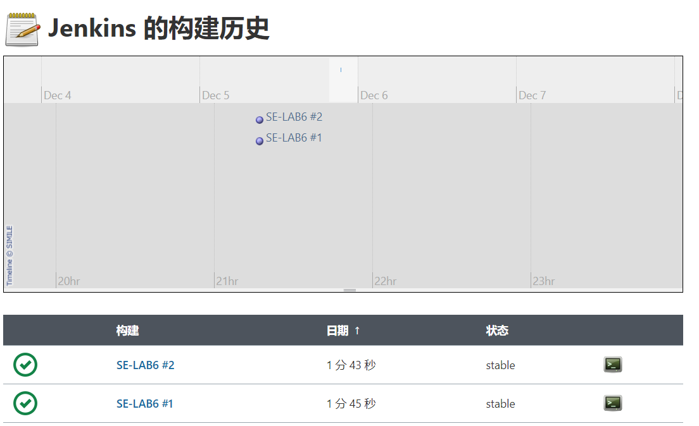

# 软件工程 Lab6

## 项目协同开发管理与工具集成环境实验

​																																								                  	**191220070 刘永鹏**

[toc]

### 实验名称

软件工程实验六: 项目协同开发管理与工具集成环境实验

### 实验目的

• 了解协同开发与持续集成过程 

• 学会使用项目协同开发管理工具 git/github 

• 了解持续集成并使用 jenkins 自动构建项目

### 实验环境

1. 软件（JDK，Android SDK，Gradle）：
   - JDK：1.8.0_231
   - Android SDK：Android 11 (API 30)
   - Gradle：
     - Android Gradle Plugin Version：7.0.3
     - Gradle Version：7.0.2
2. 硬件（安卓模拟器版本）：Pixel 2 API 30

### 实验内容

1. Git
   - 安装 git，在本地将你的开源项目目录初始化为 git 仓库 (如已有.git 文件夹请先删除)
   - 在本地尝试修改、提交、回退等过程，在报告中展示你的操作，并使用 git diff, git log, git status 等命令展示操作前后的区别
   - 根据实验三针对几个页面进行微调的任务，在本地为每个子任务创建一个分支并在各 分支上进行开发，最终将所有修改合并到 master 分支上；如有冲突请尝试解决。在报 告中展示你的操作，并使用 git log --graph 命令展示分支合并图
   - 给你的某个稳定版本的代码打上标签
   - 注册 github 账号，在账号中创建远程仓库 (权限请设置为 public)；把本地的所有分支 和标签推送到远端
   - 使用 pull request 提交自己的代码和报告 (作业提交说明里细 )
   - 在报告中回答以下问题：
     - 使用 git 的好处？
     - 使用远程仓库 (如 github/gitee 等) 的好处？
     - 在开发中使用分支的好处？你在实际开发中有哪些体会和经验？
   - 如果你额外学习并实践了关于 git/github 的其他进阶操作 (如 merge 和 rebase 的区 别、reset 和 revert 的区别、stash, cherry-pick 的使用等)，可在报告中展示
2. Jenkins
   - 在本机安装 jenkins，并在全局工具配置和系统设置中配置好 JDK 地址、Gradle 地址、 ANDROID_HOME 地址和 JAVA_HOME 地址
   - 新建任务，在源码管理中填写自己项目的 github 地址，对项目进行一次构建
   - 修改代码再次推送到 github 仓库中，再次对项目进行构建

### 实验过程与结果

#### 简单的git命令

首先，在实验3时，已经配置好了本地的Git仓库，这里首先回退到最初版本：

使用Git log查看版本号，使用git reset 将头指针指向最初版本。

现在，修改一个文件，并将修改用Git记录：

##### git diff

在修改后但还未提交修改前，使用git diff语句，将显示出修改但未保存的内容：

##### git status

git status将显示修改但未提交的文件，以及.gitignore中声明忽略的文件：

同时，如果本地git已经关联到远程仓库，该命令还将显示本地项目版本与远端的差别。

##### git log

git log 将查看历史提交记录：

#### 并行开发与merge

首先，在本地新建一个文件夹模拟远端仓库，并把项目分成相同的两份，模拟两个同步开发者：

在本地建立一个分支：

将本地代码上传到rootRep

在该分支上修改某个文件，但暂时先不提交

切换到master分支，修改与上面不同的文件，同样提交，操作与上面类似，不再展示。

现在，尝试提交修改：首先，git pull与远程仓库同步：

因为上次newbranch上传后还没有新的提交，因此显示Already up to date。如果有新的提交，本地git pull将会让本地项目同步远程仓库的修改(merge)。如果merge发生冲突(conflict)，通常是因为远程的提交中包含了本地也同时修改的文件，此时需要手动解决冲突的文件。

git会将冲突的代码全部放在冲突文件中，如下图：

(VS Code对冲突格式有特殊解析)

git pull无误，那么现在使用git add\git commit\git push三连，将newbranch的修改上传到rootRep。

上面是对newbranch的操作，对master分支执行相同操作，结果也相同，没有发生冲突：因为两个分支并没有修改同一份文件。

git log --graph:

这里为什么分支图为一条直线呢？因为我实际操作时，是先在原分支上完成修改后，再创建了新的分支。这样新的分支的origin就直接连在了原有分支的head上，相当于续写了原有分支。

两条分支并行开发时，使用 git log --graph的结果应当如下图所示：

##### git reset/revert

1. git reset放弃某次提交
2. get reset回滚到某个版本

这两者最根本的差别在于，git reset是将当前分支的HEAD指针指向命令声明的版本，而后者会生成一个新的版本，而不影响回滚版本之后提交的修改。

打个比方，git reset相当于ctrl+z撤销某一步操作，而撤销操作这一操作本身是不可以撤销的。同时，想撤销某一次修改，在那之后的所有修改都会被撤销。

而git revert则仅仅删除掉了有问题版本的修改。当然，git revert更容易出现conflicts。

在前面的步骤中，我使用git reset --hard 将项目版本回退到了最初版本，这次，使用git revert:

可以看到，git要求我们要commit本次提交，为本次commit撰写注释。也就是说，revert操作被视为提交了一个新的版本

revert成功，现在，用git log查看一下版本：

如图：revert确实创建了一个新的commit(带有tag的是revert之前的版本)，而reset只会讲指针回指，从而删除后续修改的版本。

##### git rebase/merge

merge操作更加常见，它将两个分支如下合并为一个分支。

使用git rebase，相当于将子分支上的所有操作，在主分支上复刻一遍，

初始仓库

使用merge

使用 git rebase

可以看到，git rebase相当于master先回退到fork子分支前的版本，然后执行若干次commit，将master上和newbranch上的修改都提交。

#### Jenkins

在Jenkins官网下载Jenkins，将其配置在8080端口：

点击new item,选择自由风格项目

导入本地代码并构建：

push新的commit再次构建：

#### 上传到远程仓库

首先，删除上一步中创建的分支：

给项目最终版打上标签：

在github上为了上传作业，新建一个文件夹，并将原github上fork好的项目clone下来：

配置好目录格式，上传即可。