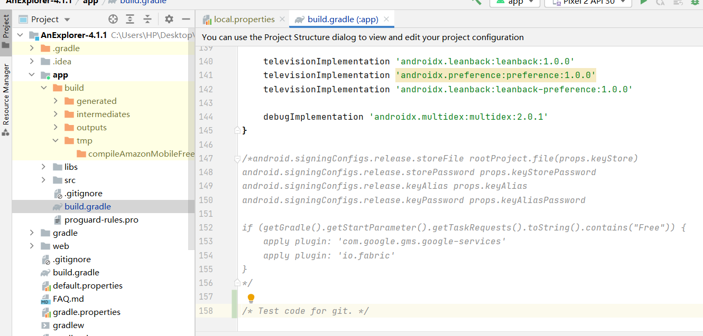
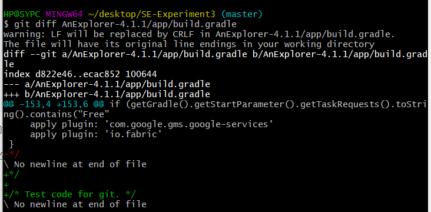
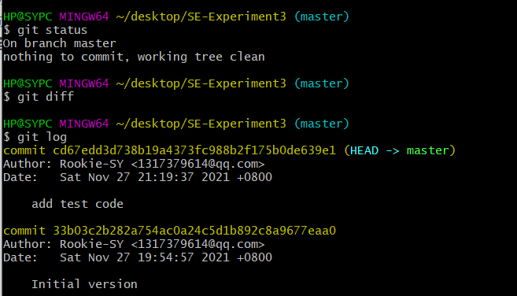
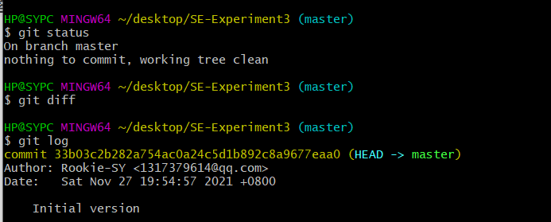
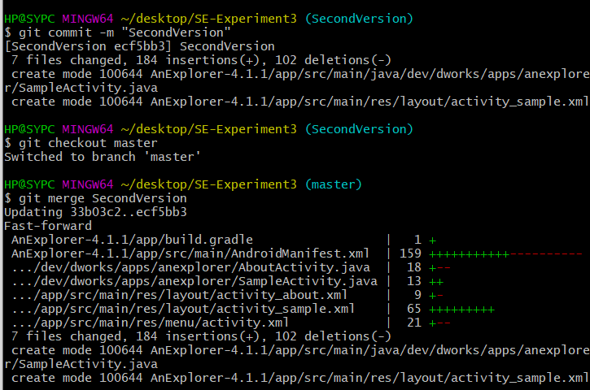
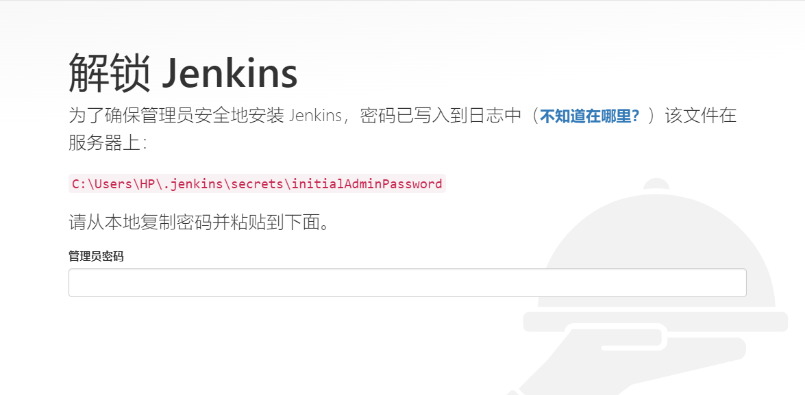
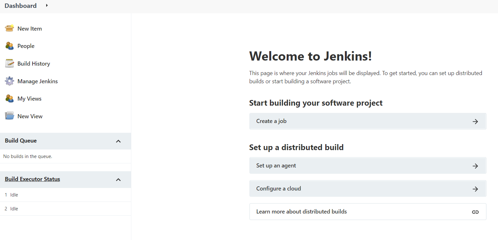
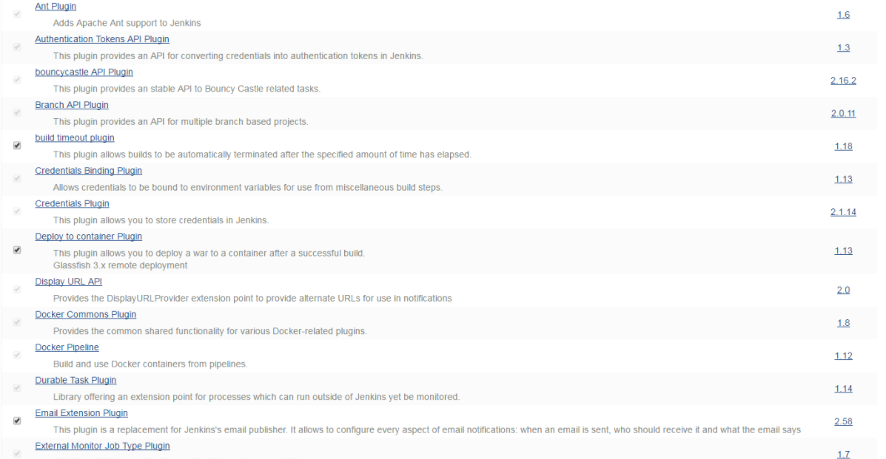
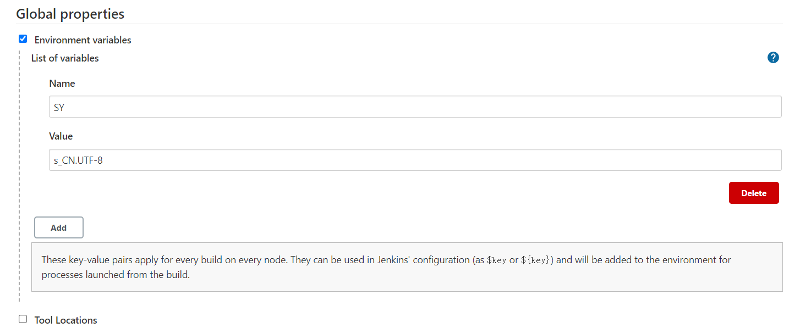
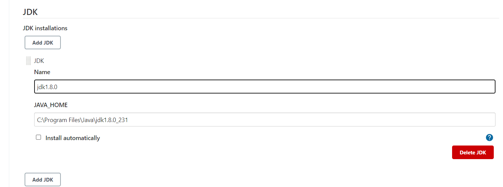

# 软件工程·第六次实验实验报告

**计算机科学与技术系 191220104 孙羽**

## 实验名称

**项目协同开发管理与工具集成环境实验**

## 实验完成情况

1. 学习并操作了`git`的一些基本操作，并使用`git`协助完成了实验三；
2. 回答了思考题；
3. 学习了手册中的`git`进阶指令；
4. 部署了`jenkins`并进行了远程`gradle`构建

## 实验内容

* 使用`git`完成开发流程

  * 安装`git`，在本地将开源项目目录初始化为`git`仓库

    首先使用`git init`命令在本地新建仓库

    之后将本地的项目目录移入新建的仓库内，再使用命令`git commit`将其上传即可将本地的开源项目目录初始化为`git`仓库

  * 本地尝试修改、提交、回退等过程，并使用`git diff`、`git log`、`git status`等命令展示操作前后的区别

    * 修改部分：

      首先在本地修改项目代码：可以看到修改目录为：`AnExplorer-4.1.1/app/build.gradle`，之后使用`git status`命令：可看到当前对应目录被修改了，但还没有准备提交的修改使用`git diff`命令：可以查看到修改的具体内容为在文件末尾加上了如下字符串

      使用`git log`命令：可以看到目前的提交记录只有最开始的初始版本，没有修改过后的版本

    * 提交部分：

      使用`git add`和`git commit`命令将修改后的文件提交

      使用`git status`、`git diff`、`git log`情况如下：

      可以看到，仓库内已无未提交的修改，且提交记录也加上了刚刚的修改部分

    * 回退部分：

      使用`git reset`命令回退到上一个版本

      使用`git status`、`git diff`、`git log`查看：

      可以看到当前版本是最开始的`Initial Version`版本，仓库回退到了上一个版本

  * 多分支下的`git`使用

    首先使用`git switch -c` 命令新建并从`master`切换到新的分支`FirstVersion`

    

    可以用`git branch`查看当前所有的分支：

    在完成对`FirstVersion`的开发后，再新建新的分支`SecondVersion`，此分支是在`FirstVersion`的分支上得到的：

    在完成这个分支的开发后，就可以将分支合并了，因为`SecondVersion`是在`FirstVersion`的基础上开发的，所以合并时只合并第二条分支即可，将`master`切换到`SecondVersion`并前一分支删除。

    使用`git log --graph`命令查看分支合并情况：
  
    可见分支合并完成
    
  * 使用`jenkins`自动构建项目
  
    `jenkins`可以自动化处理大量代码构建，可以解决大量的重复操作。可以想到的使用场景：多人同时对同一安卓项目进行开发，他们将代码都推送到同一远程仓库，通过配置`jenkins`，对于每一次的提交均对项目进行`gradle`构建，若失败就向管理员发送邮件。这样，每一次代码更新后都会自动尝试构建代码，可以便捷地找到哪一次提交使得代码构建失败。
  
    对`jenkins`的使用：
  
    下载`.war`文件进行安装，在`D:\jenkins`内打开终端，执行命令：`java -jar jenkins.war`
  
    之后再在浏览器访问：`ip + port`，本机为：`192.168.1.190:8080`，进入`jenkins`配置：
  
    输入密码登录后，选择安装推荐的插件之后进入`jenkins`：
  
    进入系统设置之后，进入插件管理，管理插件安装：
  
    之后再进入基本设置：添加编码全局属性：
    
    增加系统管理员邮件地址：
    
    添加全局配置：
    
    完成之后，添加任务，类型选择自由风格：
    
    接下来设置`github`仓库和账号、配置`gradle`、`Post-build Actions`等，之后点击`build now`可以开始构建，由于网络问题无法成功`build`。
    
    但根据网上教程等流程大体如此，除此之外`jenkins`还可以设置`build`触发器、设置定期构建、每次提交构建等。
    
  * 思考题
  
    1. 使用`git`的好处？
  
       使用`git`可以使得代码进行版本回溯，抵消了不正确编程后带来的单靠人力不能解决的错误；
  
       可以创建多个分支进行多人员协同开发，提高了效率；
  
       可以确定代码更改轨迹，使得较大项目的每一次更改及任务分配正确性更高
  
    2. 使用远程仓库（如`github`/`gitee`等）的好处？
  
       `github/gitee`是基于`git`的版本管理工具，将代码存放在云端的仓库后首先可以防止丢失；再其次可以将项目代码共享给同一工作组的同事，避免了线下代码沟通的不便；同时其上还有众多开源项目，可以提高自身能力。
  
    3. 在开发中使用分支的好处？你在实际开发中有哪些体会和经验？
  
       * 分支的好处
  
         可以有效防止源码污染，利于代码版本的回退；
  
         利于多人员协同开发，提高效率；
  
         使得不同版本间有清晰区分
  
       * 体会和经验
  
         分支生成后，通过`git switch`等命令可以在`master`与多分支间切换，使得开发更加灵活；同时`git log --graph`等命令也可以帮助清晰分支脉络。
  
  * 额外学习的指令
  
    1. `git reset`和`git revert`
  
       `git reset`是单纯将`head`回退，而`git revert`是将`head`指到一个新的版本，该版本与我们想要回退到的版本一致。
  
    2. `git rebase`和`git merge`
  
       `git merge`合并时会产生分叉，`git rebase`使分叉变成一条流程线。
  
    3. `git switch`和`git checkout`
  
       `git switch -c`可以新建一个分支并将`head`指向其，这是等同于`git checkout -b`的命令，并且从语言理解的角度而言歧义更少。
  
    4. `git stash`
  
       `git stash`会将所有未提交的修改都保存起来，便于后续工作中恢复。
  
* 实验感想

  * `jenkins`是一个自动化处理大量代码构建的工具，可以解决大量的重复的对安卓开发的工作，通过`jenkins`的配置完成，多人的同时开发可以使得每一次代码更新后自动尝试构建代码，不需要再在发现构建失败后去排查版本。

  * `git`的众多指令其实有相像与区别，在使用时需进行一定的区分。使用`git`开发可以进行更放心的项目构建。

