# 南京大学计算机科学与技术系软件工程实验报告

#### 实验名称：项目协同开发管理与工具集成环境实验

#### 学号：191220185

#### 姓名：朱嘉琦

#### 指导教师：张天

#### 实验地点：基础实验楼208

#### 实验时间：2022.1.1

## 一、实验名称

项目协同开发管理与工具集成环境实验

## 二、实验要求

1. 了解协同开发与持续集成过程
2. 学会使用项目协同开发管理工具 git/github
3. 了解持续集成并使用 jenkins 自动构建项目

## 三、实验环境

软件：Andriod Studio 2020.3.1 Android 11.0 (Google API) Pixel 2 API 30 x86_64

硬件：Windows11 + intel i7 9th Gen

项目名称： Simple Explorer

## 四、实验内容

1. 安装 git，在本地将你的开源项目目录初始化为 git 仓库 (如已有.git 文件夹请先删除)

2. 在本地尝试修改、提交、回退等过程，在报告中展示你的操作，并使用 git diff, git log, git status 等命令展示操作前后的区别

3. 根据实验三针对几个页面进行微调的任务，在本地为每个子任务创建一个分支并在各分支上进行开发，最终将所有修改合并到 master 分支上；如有冲突请尝试解决。在报告中展示你的操作，并使用 git log --graph 命令展示分支合并图

4. 给你的某个稳定版本的代码打上标签

5. 注册 github 账号，在账号中创建远程仓库 (权限请设置为 public)；

6. 把本地的所有分支和标签推送到远端

7. 使用 pull request 提交自己的代码和报告 (作业提交说明里细🔒)

8. 在报告中回答以下问题：

    • 使用 git 的好处？

    • 使用远程仓库 (如 github/gitee 等) 的好处？

    • 在开发中使用分支的好处？你在实际开发中有哪些体会和经验？

9. 如果你额外学习并实践了关于 git/github 的其他进阶操作 (如 merge 和 rebase 的区别、reset 和 revert 的区别、stash, cherry-pick 的使用等)，可在报告中展示

## 五、实验结果与说明

#### 1. 在本地尝试修改、提交、回退等过程，在报告中展示你的操作，并使用 git diff, git log, git status 等命令展示操作前后的区别

在本地的项目代码中的README文件增加一行内容并保存：

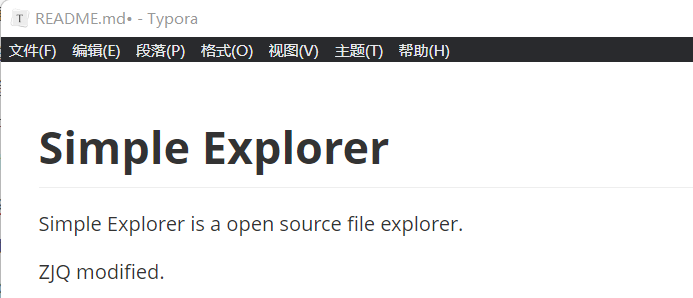

可以通过`git status`命令发现仓库内有修改后的文件：

然后用`git diff`查看修改前后区别：

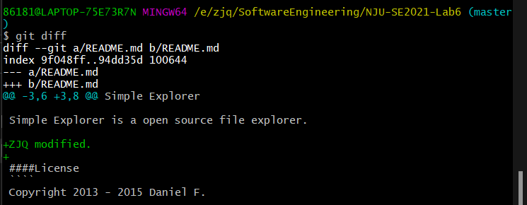

`git commit`在本地提交之后，再`git diff `查看结果：

然后用`git log `可以查看提交记录：

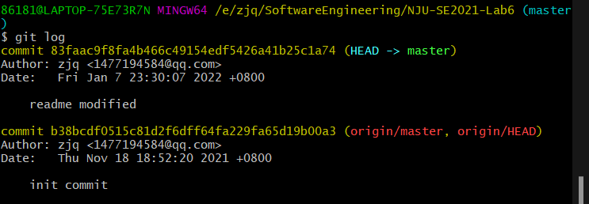

此时再`git status`查看状态：

然后尝试回退，根据需要回退的序列号，这里是b38bcd开头的版本，故`git reset b38bcd`:

这里unstaged changes即之前对README的修改，回退到原来的版本后README的修改还没有提交到仓库，这时候分别用`git diff`和`git status`查看修改和仓库状态：

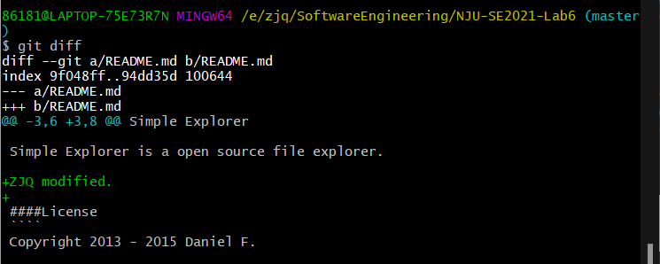

然后`git log`可以查看当前版本是修改前的版本：

#### 2. 根据实验三针对几个页面进行微调的任务，在本地为每个子任务创建一个分支并在各分支上进行开发，最终将所有修改合并到 master 分支上；如有冲突请尝试解决。在报告中展示你的操作，并使用 git log --graph 命令展示分支合并图

首先创建一个新的分支，`git checkout -b modify_1`，创建一个名为modify_1的分支并切换，然后`git branch`查看当前分支，*表示当前分支：

在modify_1上开发完成后提交，并切换回master，`git checkout -b modify_2`，进行第二个分支的开发：

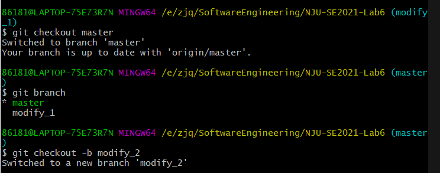

同样的操作创建第三个分支，现在主体开发完成，切换回master后会发现，在分支上进行的开发消失了，这是因为还没有对分支进行合并，所以现在需要进行分支的合并，`git merge modify_1`，并`git log --graph`查看合并过程

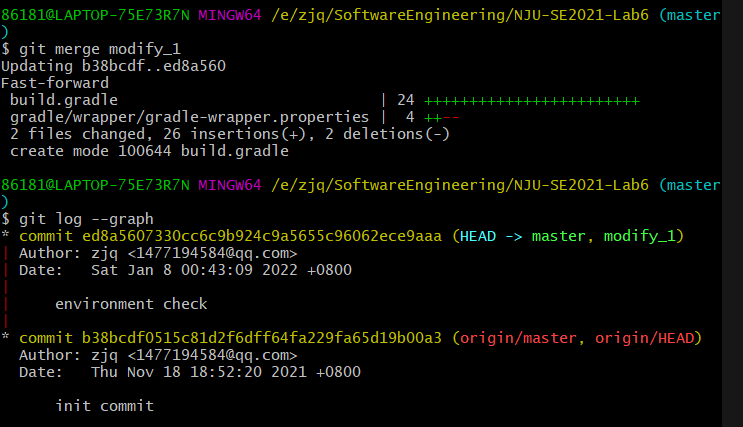

然后合并modify_2和modify_3:

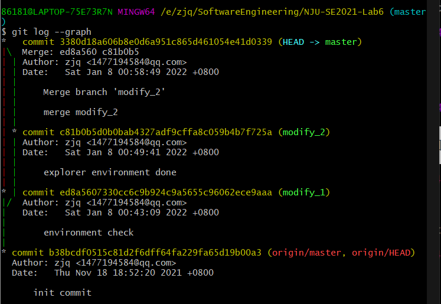

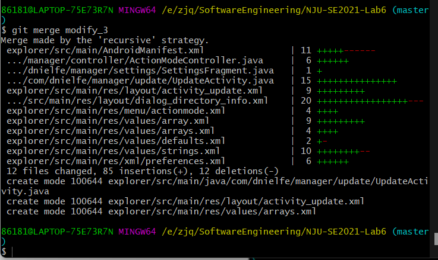

#### 3. 给你的某个稳定版本的代码打上标签

合并最后一个分支后已经是一个稳定版本了，为其打上标签，`git tag -a SimpleExplorerv1.0`

最后push到远程仓库`git push --tags`

可以在github上查看到新的tag

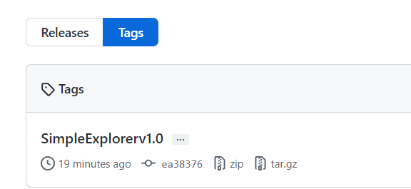

#### 4. 回答如下三个问题

- ##### 使用 git 的好处？

  1. 本地拥有版本库，方便地进行版本控制，随时进行版本后退，而且很容易创建分支，可以在分支间切换
  2. 通过分支，便于同时开发不同功能，提高开发效率，能够分别对不同功能进行测试，而且分支合并的能力防止了分支之间产生冲突导致程序出现问题
  3. 代码修改、分支的可视化，利用树形图等形象地表示了开发过程，有利于开发中的逻辑梳理

- ##### 使用远程仓库 (如 github/gitee 等) 的好处？

  1. 远程仓库安全稳定，便于代码保存，可以作为项目的备份，如果本地仓库出现故障可以从远程仓库重新拉取
  2. 适合团队开发，如果有多个人协作开发，那么每个人各自从远程克隆一份就可以了，而且能够快速从远程仓库抓取到最新进度，利于项目开发
  3. 远程仓库每个人都可以fork和pull request，可以聚集大家的智慧，利于功能迭代与技术交流

- ##### 在开发中使用分支的好处？你在实际开发中有哪些体会和经验？

  1. 便于同时开发不同功能，提高开发效率，分别对不同功能进行测试
  2. 在分支上开发，如果出现问题可以舍弃掉这一分支，重新开发
  3. 分支之间可以切换，可以同时推进多个方面，提升模块化程度
  4. 如果是团队开发，分支开发使每个人有自己的独立分支而不是全部在master分支上开发，全部在master分支上开发弊端太多，比如隔离性太差，可能会出现很多冲突，而在独立分支上开发的话，不需要频繁的解决冲突，可以专注于手头的功能开发

## 六、额外学习

### merge 和 rebase 的区别

merge在合并不同分支时已经使用过，merge会将两个分支合并后，形成一个新的commit，现在尝试用rebase去合并分支，首先还是切换到modify_1分支，这里使用一个新命令`switch`，因为checkout命令不管是创建切换还是删除分支都是用的这一个命令，容易混淆，而switch相比直观很多

在这个分支中对README做出修改，将修改提交后，切换到master分支，尝试rebase，发现分支的commit直接被放到了master分支的commit内，也就是说modify_1中的commit也就消失了，而merge会把两个分支合并在一起，形成一个新的 commit 提交。

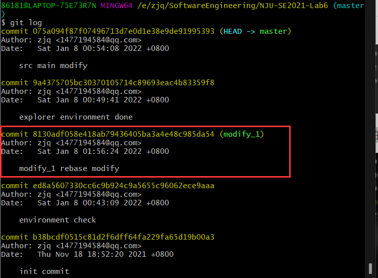

#### stash的使用

`git stash`能够将所有未提交的修改（工作区和暂存区）保存至堆栈中，用于后续恢复当前工作目录，比如我正在开发一个新功能（这里README被修改了），然后突然有一个原程序中的bug需要紧急被修复，这是我应该暂停手上的工作先去解决bug，但是我手头的工作又没有完成不希望提交，这时候可以使用stash暂存这些修改：

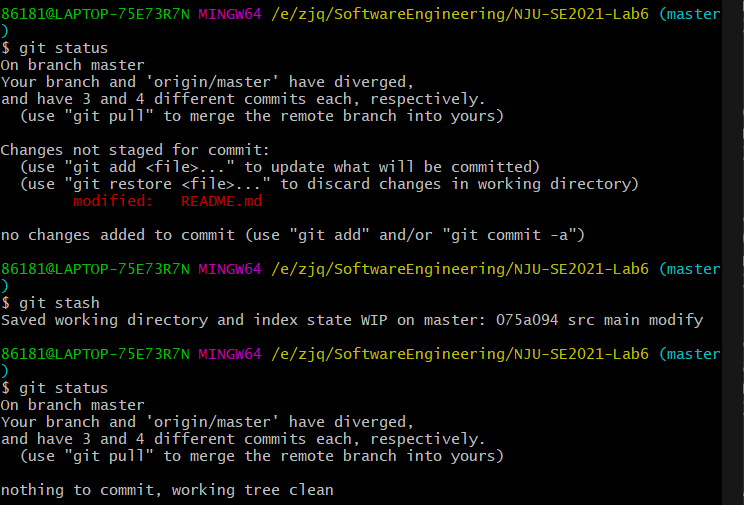

## 七、总结

本次实验让我印象最深的是分支，我之前在暑假与同学开发过unity的游戏，当时第一次用github来进行团队开发，遇到了很多问题，当时不知道如何使用分支，然后就经常发生冲突无法合并，然后每次都强制push，有时候出现了问题都不知道是哪一环出了问题，这次实验中深入了解了分支管理等知识，发现熟练掌握git之后能很大程度帮助开发的流畅性，让我们专注于功能开发本身。